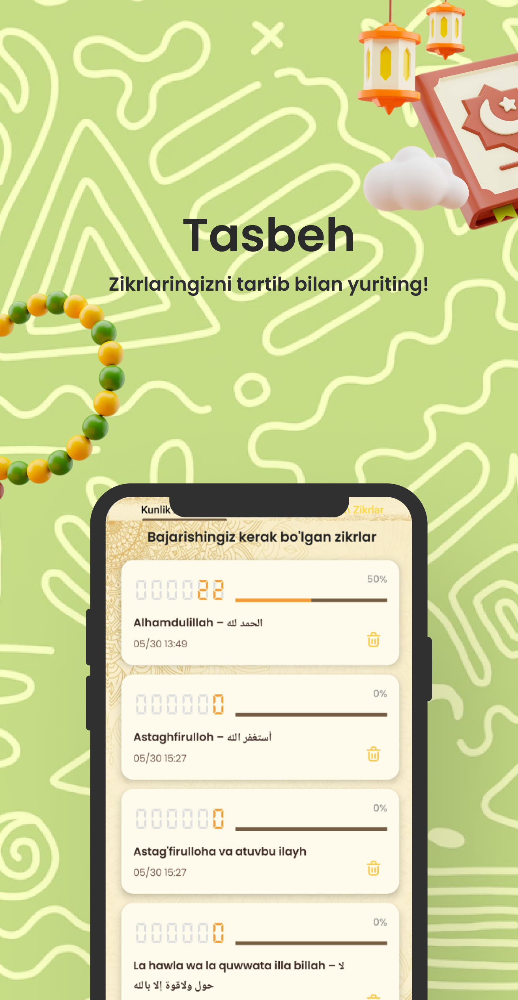
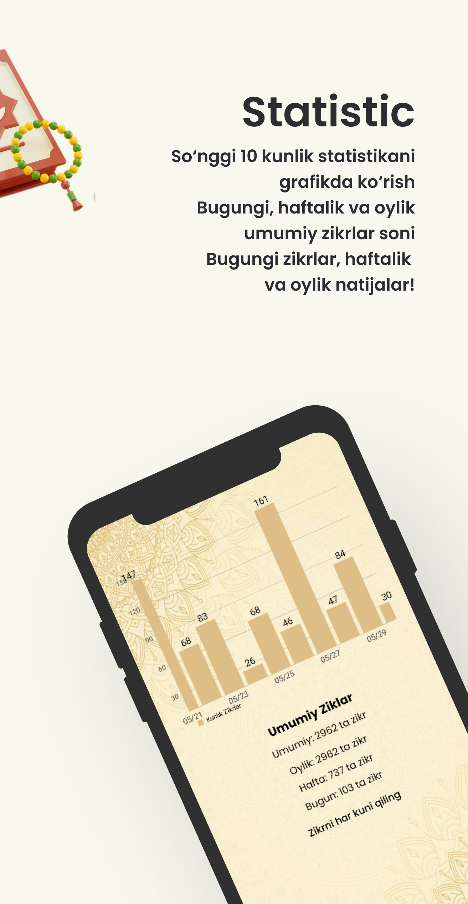

# 📿 Tasbeh Tracker

> 🇺🇿 O'zbekcha | 🇺🇸 English | 🇰🇷 한국어

---

## 🇺🇿 O‘zbekcha

**Tasbeh Tracker** — bu foydalanuvchining har kuni o'qigan tasbeh sonlarini saqlab boruvchi va kunlik statistikani ko‘rsatib beruvchi Android ilova. Kotlin tilida yozilgan va `RoomDB` ma'lumotlar bazasidan foydalanadi.

## 🛠 Texnologiyalar | Technologies | 사용 기술

- Kotlin  
- RoomDB  
- Android Studio  
- ( XML)  
- MVVM Architecture  

---

## 📊 Xususiyatlar | Features | 주요 기능

- Kunlik tasbeh o‘qish hisoboti  
- Daily prayer count tracking  
- 일일 기도 횟수 기록  

- Statistikani so‘nggi 10 kun davomida ko‘rsatish  
- View statistics for the last 10 days  
- 최근 10일간의 통계 보기  

- Mahalliy bazada (Room) ma’lumot saqlash  
- Local data storage using Room  
- Room을 통한 로컬 데이터 저장  

- Minimalist dizayn  
- Minimalist design  
- 미니멀한 디자인  

---

## 📄 Litsenziya | License | 라이선스

## 📱 Ilova Ko‘rinishlari | App Screenshots | 앱 스크린샷들

<p float="left">
  
  
  
</p>


<p float="left">
 
  

</p>


## 👨‍💻 Muallif | Author | 개발자


**Ismoil**  

GitHub: [@ismoil201](https://github.com/ismoil201)


### 🚀 O‘rnatish

```bash
git clone git@github.com:ismoil201/tasbeh.git
cd tasbeh.git


